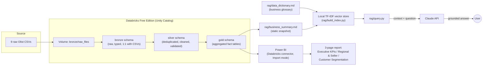

# Olist E-Commerce Analytics

An end-to-end analytics stack built on the [Olist Brazilian e-commerce
dataset](https://www.kaggle.com/datasets/olistbr/brazilian-ecommerce): a
lakehouse ETL pipeline, a Power BI report, and a Claude-powered RAG
assistant that can answer questions about the business.

This is a **portfolio project**, built to demonstrate a modern data stack
(lakehouse + BI + a conversational data assistant) end to end, including
what it looks like to adapt a plan mid-project when the original
infrastructure choice turns out to be blocked.

---

## Architecture



If Mermaid doesn't render for you, the flow in text:

```
Raw CSVs
  -> Unity Catalog Volume (bronze/raw_files)
  -> bronze Delta tables (raw, typed)
  -> silver Delta tables (deduplicated, cleaned)
  -> gold Delta tables (aggregated fact tables)
       |
       +--> Power BI (Databricks connector) --> 3-page report
       |
       +--> rag/business_summary.md --> local TF-IDF vector store --> rag/query.py --> Claude API --> grounded answer
```

---

## Tech stack

| Layer | Tool |
|---|---|
| Data platform | Databricks Free Edition + Unity Catalog |
| Storage | Delta Lake, medallion architecture (bronze/silver/gold) |
| ETL | Python / PySpark, run in Databricks notebooks |
| BI | Power BI, connected via the native Databricks connector |
| Conversational assistant | Claude API + a local TF-IDF vector store (RAG) |
| Docs | This README, Mermaid architecture diagram |

### Two infrastructure pivots

This project didn't go exactly as planned — and that's worth documenting
honestly rather than glossing over:

**Microsoft Fabric → Databricks Free Edition.** The original plan used
Microsoft Fabric for the lakehouse layer. Workspace creation was blocked by
a tenant-level restriction on the Microsoft account available for this
project. Rather than wait on IT approval outside the project's control,
the platform was swapped for Databricks Free Edition + Unity Catalog,
which offers an equivalent medallion-architecture Delta Lake setup with no
tenant dependency.

**Copilot Studio agent → folded into the Claude RAG assistant.** The
original plan included a Microsoft Copilot Studio agent connected to the
Power BI semantic model as the "conversational agent" deliverable.
Connecting it hit a second tenant-level licensing block: the Power BI
knowledge-source connector never appeared in the agent's knowledge-source
list, and the file-upload fallback failed with "User license not found."
Rather than lose that deliverable, its scope — answering business-metrics
questions grounded in the data — was folded into a Claude API + RAG
assistant instead, which also picked up data-dictionary Q&A as a second
capability. See `specs/04-copilot-studio-agent.md` for the full account.

Both pivots are the kind of infrastructure constraint a real project runs
into — the point of documenting them here is the adaptation, not treating
them as failures.

---

## What's built

### Bronze → silver → gold ETL

All 9 raw Olist CSVs are loaded into `olist_ecommerce.bronze`, then
transformed through `olist_ecommerce.silver` into 4 gold-layer fact tables
consumed directly by Power BI and the RAG assistant (`etl/02_silver_gold_etl.py`,
full transform logic in `specs/02-silver-gold-etl.md`).

Key data-quality decisions made along the way:

- **`order_reviews` dedup**: some orders have multiple review rows. Kept
  the row with the latest `review_creation_date` per `order_id` (tie-break:
  latest `review_answer_timestamp`).
- **~1,069 malformed `review_score` values**: caused by embedded special
  characters in free-text review comments corrupting the adjacent score
  column during CSV parsing. Handled with `try_cast` — malformed values
  become null rather than guessed at, and nulls are excluded from every
  `avg_review_score` calculation (not treated as zero, not dropped from
  the table).
- **`order_reviews` row count (99,743) vs. total orders (99,441)**: a
  small number of corrupted `order_id` values in the raw reviews data
  don't match real orders. A known raw-data quirk, not an ETL bug.
- **`geolocation` collapse**: ~1,000,163 raw address-level rows collapsed
  to 19,015 rows — one per `geolocation_zip_code_prefix` — using average
  lat/lng and the mode (most frequent) city/state per prefix.

### Power BI report

3 pages, built manually in Power BI Desktop against the 4 gold tables via
the Databricks connector (Import mode):

1. **Executive KPI Dashboard** — total revenue, total orders, avg order
   value, on-time delivery rate; revenue-over-time line chart; date/state
   slicers.
2. **Regional & Seller Performance** — revenue by state; top-sellers table
   with review scores; delivery delta by state.
3. **Customer Segmentation (RFM)** — recency/frequency/monetary scatter
   plot; customer counts and avg monetary value by `rfm_segment`.

9 DAX measures across the 4 gold tables: `Total Revenue`, `Total Orders`,
`Avg Order Value`, `On-Time Delivery Rate`, `Avg Delivery Delta (Days)`,
`Total Seller Revenue`, `Avg Seller Review Score`, `Customer Count`,
`Avg Customer Monetary Value`. Full spec in `specs/03-powerbi-model.md`.

### Claude RAG assistant

Two-part scope, covering both the original data-dictionary use case and
the business-metrics questions originally intended for the abandoned
Copilot Studio agent:

1. **Data dictionary Q&A** — grounded in `rag/data_dictionary.md`, which
   documents all 4 gold tables' grain, columns, and known data-quality
   caveats.
2. **Business-metrics Q&A** — grounded in `rag/business_summary.md`, a
   static snapshot of the same figures verified in the Power BI report
   (total revenue, delivery SLA, top sellers, revenue by state, customer
   segments).

Retrieval is a local TF-IDF vector store (`rag/build_index.py`, scikit-learn
`TfidfVectorizer` + cosine similarity over ~12 chunks) — no hosted vector
DB needed at this scale, and no second API key beyond `ANTHROPIC_API_KEY`.
`rag/query.py` retrieves the top-k relevant chunks for a question and sends
them to the Claude API as context.

All 9 original grounding questions (see `specs/05-rag-assistant.md`) were
run live against the Claude API and returned correct, well-grounded
answers — including open-ended questions like "how does seller review
score relate to revenue," which required reasoning over retrieved context
rather than a single lookup.

---

## Repo structure

```
specs/       One markdown spec per phase, written before code.
etl/         PySpark scripts (bronze -> silver -> gold), run as
             Databricks notebooks.
rag/         Data dictionary, business summary, vector store builder,
             and the query.py CLI for the Claude RAG assistant.
gold/        Exported gold-layer outputs, if needed locally.
powerbi/     DAX measures, Power Query M scripts, .pbix.
copilot-studio/  Exported topics/config from the abandoned agent attempt.
docs/        Architecture diagram, screenshots.
CLAUDE.md    Project instructions for Claude Code.
README.md    This file.
```

---

## Running the RAG assistant locally

**Requirements**: Python 3.11+, an `ANTHROPIC_API_KEY` with an active
credit balance.

```bash
cd rag
pip install -r requirements.txt
export ANTHROPIC_API_KEY="sk-ant-..."   # not read from a .env file — export it each session

python query.py "What was our total revenue?"
python query.py "How does seller review score relate to revenue?" --show-context
```

`build_index.py` runs automatically the first time you query (or whenever
`data_dictionary.md` / `business_summary.md` are newer than the cached
index) — no separate build step required.

**Apple Silicon / Intel dependency gotcha**: if you hit import errors or
segfaults from `anthropic`, `pydantic`, or `scikit-learn` after installing
under a different Python architecture than you're running (e.g. an x86_64
wheel under an arm64 interpreter, or vice versa), force a clean
architecture-matched reinstall:

```bash
pip install --force-reinstall --no-cache-dir anthropic pydantic scikit-learn
```

---

## Example questions this project can answer

**"Which regions actually drive our revenue?"** — São Paulo alone accounts
for roughly 37% of total revenue despite being one of 27 states with
sales, more than the next two states (Rio de Janeiro and Minas Gerais)
combined. The regional breakdown in `daily_sales_by_region` (and the RAG
assistant's answer to "which state generated the most revenue?") makes
that concentration immediately visible, which matters for anyone deciding
where to focus logistics or marketing spend.

**"Are we actually hitting our delivery promises?"** — 93.2% of orders
arrive on or before their estimated delivery date, and on average orders
arrive nearly 12 days *earlier* than estimated — suggesting Olist's
delivery estimates are set conservatively rather than the platform
struggling to hit tight SLAs. That's a very different story than "93% on
time" tells on its own, and it's the kind of nuance the RAG assistant
surfaces when asked to reason about the number rather than just report it.

**"Who are our best sellers, and does 'best' mean what you'd assume?"** —
the top 10 sellers by revenue span a review-score range of 3.49 to 4.34,
with no strong correlation between revenue rank and review score — the
#2 seller by revenue has the *lowest* score in that group. The data
dictionary's caveat about order-level (not item-level) review attribution
on multi-seller orders explains why, and the RAG assistant connects both
facts when asked about the relationship rather than just returning a
top-10 table.
